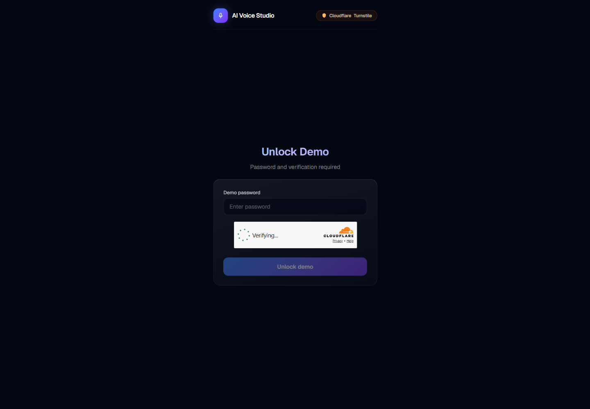
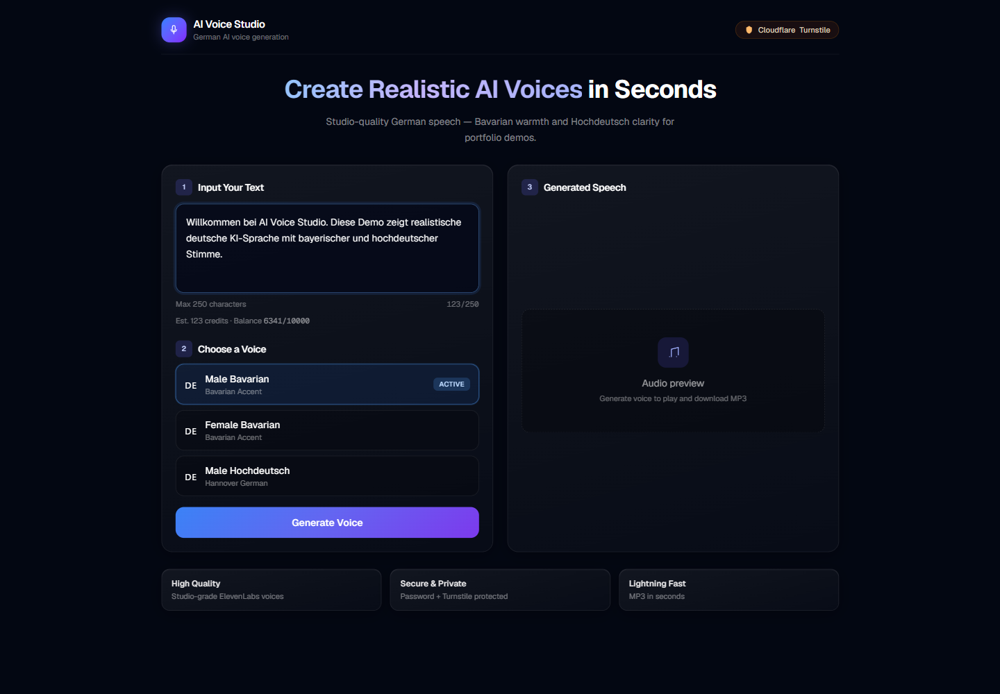
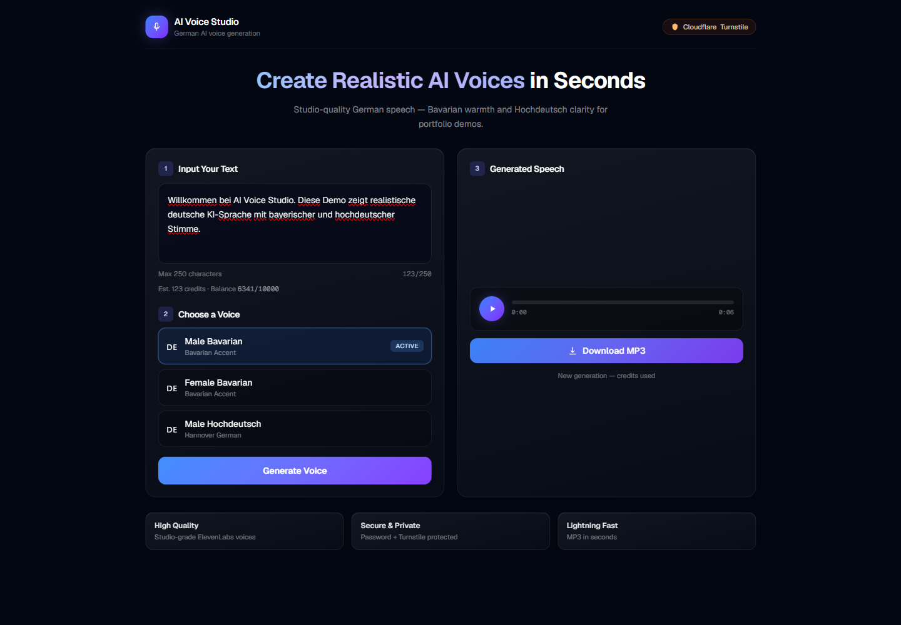

# AI Voice Studio
## Live Demo
https://ai-voice-studio-ebon.vercel.app/

https://clipscribeai-ruby.vercel.app/

Modern AI text-to-speech platform using ElevenLabs and Cloudflare Turnstile.

Experimental demo SaaS MVP for real-time German speech generation: Bavarian and Hochdeutsch voices, in-browser playback, and MP3 download. Built as a secure, rate-limited AI voice testing playground with production-style deployment patterns.

## Features

- Studio UI (Next.js 16 + Tailwind CSS 4)
- German voice presets (Bavarian male/female, Hochdeutsch male)
- ElevenLabs TTS with server-side API key handling
- MP3 playback and download
- Response caching (`X-Cache: HIT` / `MISS`)
- Access gate: shared password + Turnstile verification on unlock
- Live ElevenLabs credit balance in the UI
- Per-IP rate limiting on generation (10 requests / hour)
- Character cap for safe public demo usage

## Tech Stack

- **Framework:** Next.js 16 (App Router)
- **UI:** React 19, Tailwind CSS 4
- **TTS:** ElevenLabs API
- **Security:** Cloudflare Turnstile, session password header, in-memory rate limit
- **Language:** TypeScript

## Screenshots

| Screen | Description |
|--------|-------------|
|  | Secure unlock: password + Cloudflare Turnstile |
|  | Text input, voice selection, and generation controls |
|  | Generated speech player and MP3 export |

Regenerate locally: `npm run build`, `npm run start` (port 3001), then `SCREENSHOT_BASE_URL=http://127.0.0.1:3001 SCREENSHOT_HEADED=1 npm run screenshots`.

## Local Setup

```bash
git clone https://github.com/mamunzaman/ai-voice-studio.git
cd ai-voice-studio
npm install
cp .env.example .env.local
```

Fill in `.env.local`, then:

```bash
npm run dev
```

Open [http://localhost:3000](http://localhost:3000).

## Environment Variables

Copy `.env.example` to `.env.local`:

| Variable | Required | Description |
|----------|----------|-------------|
| `ELEVENLABS_API_KEY` | Yes | ElevenLabs API key (server only) |
| `ELEVENLABS_VOICE_MALE_BAVARIAN_ID` | Yes | Voice ID for Bavarian male |
| `ELEVENLABS_VOICE_FEMALE_BAVARIAN_ID` | Yes | Voice ID for Bavarian female |
| `ELEVENLABS_VOICE_MALE_HOCHDEUTSCH_ID` | Yes | Voice ID for Hochdeutsch male |
| `NEXT_PUBLIC_TURNSTILE_SITE_KEY` | Yes | Cloudflare Turnstile site key |
| `TURNSTILE_SECRET_KEY` | Yes | Turnstile secret (server only) |
| `NEXT_PUBLIC_DEMO_PASSWORD` | Yes | Client-side demo password check |
| `DEMO_PASSWORD` | Yes | Server-side demo password (must match) |
| `NEXT_PUBLIC_MAX_TEXT_LENGTH` | No | UI character limit (default 5000) |
| `MAX_TEXT_LENGTH` | No | Server character limit (default 5000) |

Restart the dev server after changing env values.

## Security Notes

- Never commit `.env.local` or real API keys.
- `ELEVENLABS_API_KEY` and `TURNSTILE_SECRET_KEY` stay server-side only.
- Turnstile is verified once at unlock (`/api/verify-demo`).
- Voice generation requires `x-demo-password` header.
- `/api/generate-voice` applies in-memory rate limiting: **10 requests per IP per hour**.
- Rate limits reset on serverless cold starts (MVP tradeoff).
- Protect or remove `/api/usage` before full public launch if needed.

## Deployment (Vercel)

Detailed guide: [docs/DEPLOYMENT.md](./docs/DEPLOYMENT.md)

### Exact Vercel steps

1. Sign in at [vercel.com](https://vercel.com) with GitHub.
2. **Add New Project** → Import `mamunzaman/ai-voice-studio`.
3. Confirm settings:
   - **Framework:** Next.js
   - **Root Directory:** `.`
   - **Build Command:** `npm run build`
   - **Install Command:** `npm install`
4. **Environment Variables** → add every variable from the checklist below (Production + Preview).
5. **Deploy** → wait for build success.
6. Open `https://<your-project>.vercel.app` and run the post-deploy checklist.

### Production environment variable checklist

Copy from `.env.example`. In Vercel, add each name/value (no quotes):

| Variable | Vercel scope | Secret? |
|----------|--------------|---------|
| `ELEVENLABS_API_KEY` | Production, Preview | Yes |
| `ELEVENLABS_VOICE_MALE_BAVARIAN_ID` | Production, Preview | Yes |
| `ELEVENLABS_VOICE_FEMALE_BAVARIAN_ID` | Production, Preview | Yes |
| `ELEVENLABS_VOICE_MALE_HOCHDEUTSCH_ID` | Production, Preview | Yes |
| `NEXT_PUBLIC_TURNSTILE_SITE_KEY` | Production, Preview | No (public) |
| `TURNSTILE_SECRET_KEY` | Production, Preview | Yes |
| `NEXT_PUBLIC_DEMO_PASSWORD` | Production, Preview | No (client-visible) |
| `DEMO_PASSWORD` | Production, Preview | Yes |
| `NEXT_PUBLIC_MAX_TEXT_LENGTH` | Production, Preview | No |
| `MAX_TEXT_LENGTH` | Production, Preview | No |

`NEXT_PUBLIC_*` values are embedded in the client bundle — use a demo-only password, not a production secret.

### Cloudflare Turnstile (production domains)

After deploy, in Cloudflare Turnstile → **Hostname management**, add:

- `localhost` (local dev)
- `<project>.vercel.app` (your live Vercel URL)
- `*.vercel.app` (optional, for preview deployments)
- Your custom domain when added (e.g. `voice.yourdomain.com`)

### Custom domain (later)

1. Vercel → Project → **Settings** → **Domains** → Add.
2. Point DNS per Vercel instructions.
3. Add the same hostname to Cloudflare Turnstile allowlist.
4. No code changes required.

### What can break in production

- **Turnstile:** hostname not listed in Cloudflare → CAPTCHA fails at unlock.
- **Password mismatch:** `DEMO_PASSWORD` must equal `NEXT_PUBLIC_DEMO_PASSWORD`.
- **ElevenLabs:** wrong voice IDs or quota → `502` / `ELEVENLABS_ERROR`.
- **Serverless cache:** `.cache/audio` is ephemeral — expect mostly `X-Cache: MISS` on Vercel.
- **Rate limit:** in-memory limit resets per serverless instance (MVP).
- **Function timeout:** long text may hit Vercel Hobby 10s limit; Pro allows longer (`maxDuration` set to 60s).

### Post-deploy checklist

- [ ] Unlock: password + Turnstile on production URL
- [ ] Generate speech → MP3 plays and downloads
- [ ] Wrong password → error + Turnstile reset
- [ ] Rate limit → `429` after 10 requests/hour/IP
- [ ] No API keys in browser (only public Turnstile site key + demo password in client)

## API Overview

| Route | Method | Purpose |
|-------|--------|---------|
| `/api/verify-demo` | POST | Verify password + Turnstile token |
| `/api/generate-voice` | POST | Generate MP3 (password header required) |
| `/api/usage` | GET | ElevenLabs credits (consider protecting) |

## Roadmap

- [ ] Protect `/api/usage` for production
- [ ] Persistent rate limiting (Redis / KV)
- [ ] Admin usage dashboard
- [ ] Voice preview samples
- [ ] Custom domain + analytics
- [ ] Multi-language UI copy

## License

Private project. All rights reserved unless otherwise noted.

## Author

**Md Mamunuzzaman** — [GitHub @mamunzaman](https://github.com/mamunzaman)
